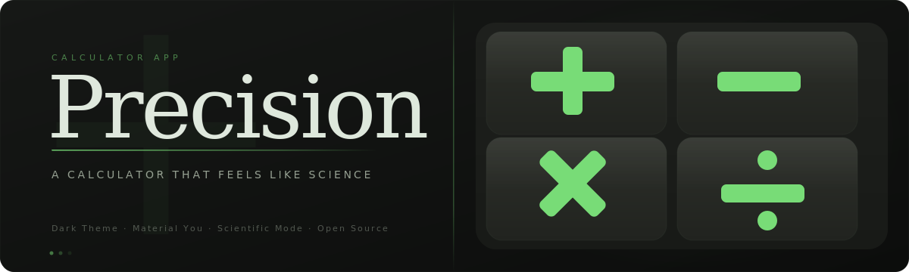

<p align="center">
  
</p>

<p align="center">
  <a href="https://flutter.dev"></a>
  <a href="https://dart.dev"></a>
  <a href="https://github.com/jayshivram/Precision/releases"></a>
  <a href="https://github.com/jayshivram/Precision/releases/latest"></a>
  <a href="LICENSE"></a>
</p>

<p align="center"><strong>A calculator that feels like science.</strong></p>

---

## What is Precision?

Precision is a clean, modern calculator app built with Flutter — designed for people who want more than just basic math. Whether you're splitting a bill, converting miles to kilometers, checking today's exchange rate, or crunching trig functions for homework, Precision handles it all from one sleek dark-themed interface.

No ads. No clutter. Just a beautiful tool that does exactly what you need.

---

## Features

### 🔢 Basic Calculator
- Addition, subtraction, multiplication, and division — the essentials done right
- Percentage calculations and sign toggle (+/−)
- Live expression preview so you can see what you're typing before you hit equals
- Full calculation history — scroll back and pick up where you left off

### 🧪 Scientific Calculator
- **Trigonometry:** sin, cos, tan (and their inverses — asin, acos, atan)
- **Logarithms:** natural log (ln) and base-10 log
- **Powers & Roots:** x², x^y, square root, e^x, 10^x
- **Constants:** π and Euler's number (e) built right in
- Factorials, absolute values, and random number generation
- Switch between **Degrees** and **Radians** with a single tap
- Parentheses for complex nested expressions

### 📏 Unit Converter
- **Length** — mm, cm, m, km, inches, feet, yards, miles
- **Area** — mm², cm², m², km², hectares, acres, ft², yd², mi²
- **Volume** — mm³, cm³, m³, liters, mL, gallons, quarts, pints, cups, fluid oz, in³, ft³
- **Mass** — mg, g, kg, metric tons, ounces, pounds, stones
- **Speed** — m/s, km/h, mph, knots
- Swap units instantly with the swap button
- Quick-reference grid showing 6 related conversions at a glance

### 💱 Currency Converter
- **36+ world currencies** with live exchange rates
- Major currencies: USD, EUR, GBP, JPY, CAD, AUD, CHF
- Asian & Pacific: CNY, INR, KRW, SGD, HKD, THB, IDR, MYR, PHP, PKR, NZD
- Middle East & Africa: AED, SAR, TRY, ZAR, NGN, EGP, KES, TZS, UGX, ZMW
- Americas: MXN, BRL, CAD
- Europe: NOK, SEK, DKK, RUB
- Searchable currency picker with country flags
- Auto-refreshing rates with configurable interval
- Last-updated timestamp and connection status indicator (online/offline/error)
- Swap currencies with one tap

### ⚙️ Settings & Preferences
- **Decimal precision** — choose how many decimal places to show (default: 6)
- **Scientific notation** toggle for very large or very small numbers
- **Thousands separator** — commas for readability (on by default)
- **Haptic feedback** — feel every button press (or turn it off)
- **Currency refresh interval** — set how often rates update automatically

### 🎨 Design & Experience
- Gorgeous **dark theme** with a vibrant green (#78DC77) accent palette
- Material Design 3 with smooth rounded corners and subtle gradients
- **Manrope** for display text, **Inter** for body — carefully chosen typography
- Animated splash screen on launch
- Responsive layout — adapts between bottom nav (mobile) and top tabs (wider screens)

---

## Download

Grab the latest signed APK from the **[Releases](https://github.com/jayshivram/Precision/releases/latest)** page — no Play Store needed. Just download, install, and go.

> **Note:** You may need to enable "Install from unknown sources" in your Android settings.

---

## Build It Yourself

Want to tinker with the code or build from source? Here's how:

### Prerequisites
- [Flutter SDK](https://docs.flutter.dev/get-started/install) (3.x or later)
- Android SDK (API 21+)
- A code editor (VS Code, Android Studio, etc.)

### Steps

```bash
# Clone the repo
git clone https://github.com/jayshivram/Precision.git
cd Precision

# Install dependencies
flutter pub get

# Run in debug mode
flutter run

# Or build a release APK
flutter build apk --release
```

### Currency API Key (Optional)

The currency converter uses the [Free Currency API](https://freecurrencyapi.com/). To enable live rates:

1. Sign up at [freecurrencyapi.com](https://freecurrencyapi.com/) and grab your free API key
2. Open `lib/constants/api_keys.dart`
3. Replace the placeholder with your key

Without an API key, the currency converter will still work but won't fetch live rates.

---

## Tech Stack

| Layer | Technology |
|-------|-----------|
| Framework | Flutter (Dart) |
| State Management | Riverpod |
| Math Engine | math_expressions |
| HTTP Client | http |
| Persistence | shared_preferences |
| Typography | Google Fonts (Manrope, Inter) |
| Formatting | intl |

---

## Project Structure

```
lib/
├── main.dart                    # App entry point
├── app.dart                     # Root widget, navigation, theming
├── constants/                   # API keys, currencies list, unit definitions
├── models/                      # Data models (settings, exchange rates, history)
├── providers/                   # Riverpod state providers
├── screens/                     # Full-page screens (calculator, converter, etc.)
├── services/                    # API services (exchange rates)
├── theme/                       # Color palette and typography
├── utils/                       # Math parser, formatters, unit conversion logic
└── widgets/                     # Reusable UI components (buttons, display, panels)
```

---

## Contributing

Found a bug? Have an idea? Contributions are welcome.

1. Fork the repo
2. Create a feature branch (`git checkout -b feature/my-idea`)
3. Commit your changes (`git commit -m "Add my idea"`)
4. Push to the branch (`git push origin feature/my-idea`)
5. Open a Pull Request

---

## License

This project is licensed under the **MIT License** — see the [LICENSE](LICENSE) file for details.

---

<p align="center">
  Built with ☕ and Flutter<br/>
  <strong>Precision</strong> — because math deserves good design.
</p>
